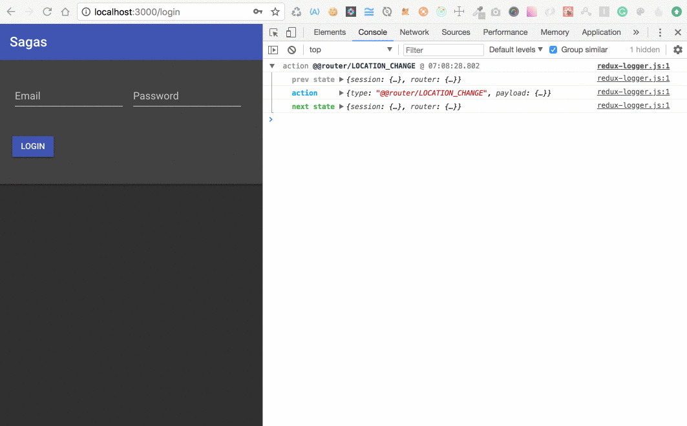

# React Redux Sagas Architecture

- https://github.com/facebook/create-react-app

- https://redux.js.org/basics

- https://github.com/reactjs/react-router-redux

- https://github.com/redux-saga/redux-saga

```
npx create-react-app redux-sagas
```



## Initial Boilerplate

```
yarn add axios history notie prop-types redux@next react-redux react-router-dom react-router-redux@next redux-saga
```

## Tooling

```
yarn add husky lint-staged prettier redux-logger -D
```

## Material-UI

React components that implement Google's Material Design.

- https://material-ui-next.com/

```
yarn add material-ui@next
```

## Inspired by

- https://medium.com/@shrsujan2007/implementation-of-redux-saga-in-react-applications-973f5a2a87d2

- https://github.com/shrsujan/react-redux-saga-demo

- https://github.com/dbroadhurst/create-react-app-redux-saga-boilerplate
